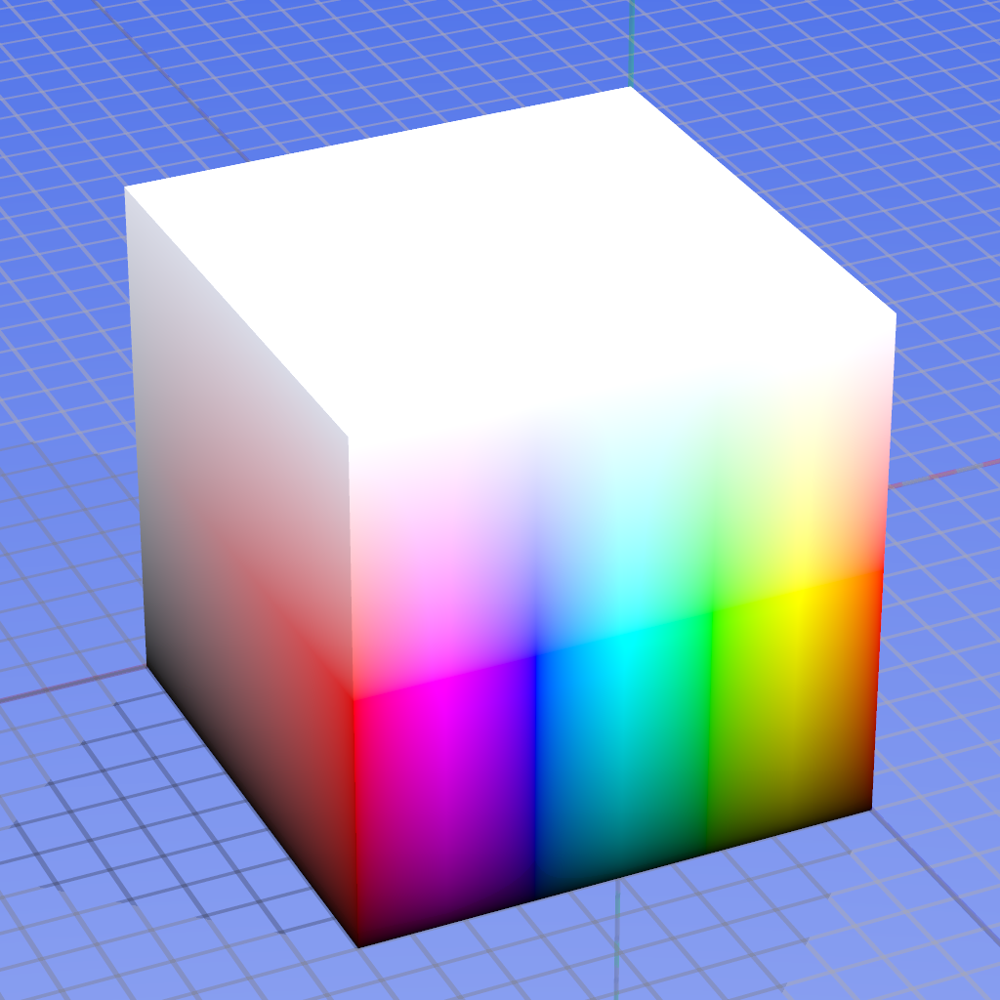

**UPDATE 2014-06-25**: _I created a library called [sweep.js](http://rileyjshaw.com/sweep/) that addresses this problem._

I was recently browsing a beautiful red monochrome[^1] site. There were a few call-to-action buttons on the page that transitioned to green on hover.

See the Pen <a href='http://codepen.io/rileyjshaw/pen/qgrKn/'>Red to green transitions are ugly</a> by Riley Shaw (<a href='http://codepen.io/rileyjshaw'>@rileyjshaw</a>) on <a href='http://codepen.io'>CodePen</a>.

Where did that brown come from?! The initial red looks great, the final green looks great, but everything between is pretty dismal. Why is that?

##The RGB color model
**R**ed **G**reen and **B**lue are the [three primary additive colors](/blog/your-art-teacher-lied). Your browser takes an 8-bit intensity value for each of the R, G, and B components to determine the output color. This is often represented as three two-digit hex values (for example, #ff8800 is orange).

<figure>
  
  <figcaption>Axes represent red, green, and blue</figcaption>
</figure>

For the subtle changes that make up 90% of color transitions, moving through RGB space looks fine since it ensures steady linear transitions between two similar endpoints. The problem with RGB is that when we start trying bolder transitions we must traverse a muddy grey no man's land in the center of the space; for example, imagine connecting yellow and blue in the cube image above.

## The HSL representation

HSL stands for **H**ue, **S**aturation, **L**ightness. It maps RGB's cartesian space to cylindrical coordinates, which means that hue is represented as an angle around the RGB color wheel. It's a friendlier representation to use since changes can be more explicit. For example, to make an intense red more subdued, just reduce saturation from 100% to 50%. For comparison, doing this in RGB requires reducing R from 255 to 191 and increasing G and B from 0 to 64.

<figure>
  
  <figcaption>Axes represent hue, saturation, and lightness</figcaption>
</figure>

Passing RGB values lets you manipulate pixels as though you were mixing paint. HSL abstracts this process so that you're describing the color that you want rather than the colors that _make up_ the color that you want.

## Transitioning through HSL

Since HSL takes _hue_ as one of its arguments, you'd think that transitioning from one hue to another would be a breeze. Sadly, browsers convert all HSL colors to their RGB counterparts before using them, so transitions between RGB and HSL end up looking the exact same.

See the Pen <a href='http://codepen.io/rileyjshaw/pen/GLKrD/'>Red to green transitions are still ugly</a> by Riley Shaw (<a href='http://codepen.io/rileyjshaw'>@rileyjshaw</a>) on <a href='http://codepen.io'>CodePen</a>.

We can do better than this, but we're going to have to use some JavaScript. [There has been discussion](http://lists.w3.org/Archives/Public/www-style/2012May/1060.html) of changing the way HSL transitions work in the browser, but nothing's come of it yet. For now, let's run a little comparison that updates both RGB and HSL values at each step.

See the Pen <a href='http://codepen.io/rileyjshaw/pen/uonyi/'>Transitions through RGB and HSL spaces</a> by Riley Shaw (<a href='http://codepen.io/rileyjshaw'>@rileyjshaw</a>) on <a href='http://codepen.io'>CodePen</a>.

The HSL transition maintains a consistent saturation, so we're able to avoid the sludge of RGB. Unfortunately, we're still left with an awkward transition. Our HSL version peaks in lightness at yellow, leaving a jarring shift between yellow and the final color. Though the colors are nicer through HSL, the RGB version is still more appealing since it has natural apparent timing.

We can come up with a localized easing function to make the HSL transition smoother. By mapping the trough of a sine curve to the peak at the center of our transition, we can move slowly through the area where change is greatest:

See the Pen <a href='http://codepen.io/rileyjshaw/pen/Levyq/'>HSL transition with easing</a> by Riley Shaw (<a href='http://codepen.io/rileyjshaw'>@rileyjshaw</a>) on <a href='http://codepen.io'>CodePen</a>.

The adjusted version looks better, but it's still not great. A smooth transition could be reached after extensive tweaking, but our timing function would only be relevant for a red-to-green transition; any other combinations would require their own custom timing functions.

## The unbearable lightness of being

The real issue here is that HSL does a bad job dealing with _perceived_ lightness. Here's the HSL spectrum with 50% lightness:

<figure>
  
</figure>

And here's the associated lightness values based on [CIE's definition of lightness](http://en.wikipedia.org/wiki/Lab_color_space#CIELAB):

<figure>
  
</figure>

This is why color pairs require custom timing functions. Our eyes try to find a pattern when they notice changes in lightness. In RGB, we get consistently lighter or darker, so the linear shift is easy for our eyes to comprehend. In HSL, we ride a crazy, inconsistent wave of light/dark patches until we arrive at our destination. Since our eyes can't discern a pattern, the transition between color-groups feels springy.[^2]

## HUSL to the rescue?

Plenty of discussions on the inconsistencies of HSL lightness already exist, so I've thrown some of my favorite links into the [references](#references). One particularly awesome project is [HUSL](http://www.boronine.com/husl/), which uses CIE's definition of lightness to smooth out the space. In HUSL, large-angle transitions appear less jumpy; check it out!

See the Pen <a href='http://codepen.io/rileyjshaw/pen/ArhLK/'>HUSL to the rescue</a> by Riley Shaw (<a href='http://codepen.io/rileyjshaw'>@rileyjshaw</a>) on <a href='http://codepen.io'>CodePen</a>.

HUSL gets us very close to perceptually linear hue-angle transitions. It also puts a ceiling on our saturation, dragging us closer to the sludgy colors that we've been avoiding all along. Some transitions like cyan to violet end up looking awesome. Others, such as our original example of red to green, look far worse than they would in RGB or HSL.

See the Pen <a href='http://codepen.io/rileyjshaw/pen/Lexkg/'>HUSL Transitions: A good'n and a bad'n</a> by Riley Shaw (<a href='http://codepen.io/rileyjshaw'>@rileyjshaw</a>) on <a href='http://codepen.io'>CodePen</a>.

We've come all this way, we've systematically solved all of our problems with the initial transition, and we still ended up with something worse than what we started with. What gives?

## Conclusion

It turns out that there's no _one best way_ to transition between colors. Sometimes we need overlaying text to remain readable, so consistency of lightness is the primary concern. Sometimes, we just want consistently pretty colors. A summary of the benefits and shortcomings found is shown below:

|                            | RGB   | HSL   | HUSL  |
| -------------------------- | ----- | ----- | ----- |
| Browser support            | Best  | Okay  | Worst |
| Lightness consistency      | Okay  | Worst | Best  |
| Linear timing              | Best  | Worst | Okay  |
| Pretty intermediate colors | Worst | Best  | Okay  |
| Simplicity                 | Okay  | Best  | Worst |
| True colors                | Best  | Best  | Worst |

It's all contextual and boils down to choosing a method that's suited to your application. Use HUSL for text containers to ensure that everything remains readable. Use HSL when you need to transition from grey to full-juice saturation. For a design-heavy red website, maybe the _real_ answer is to forgo red-green transitions altogether and [choose a different link effect](http://tympanus.net/Development/CreativeLinkEffects/).

Remember, since _browsers only support transitions through RGB_ right now they should be your go-to on the web for all but the most special cases. I hope that [the spec](http://www.w3.org/TR/css3-transitions/#animation-of-property-types-) will start supporting hue-angle transitions as the default between two HSL colors, but it's a long way away. For now, be conscious of the color paths that your transitions are taking. If you don't like them, experiment!

## References

-   [A Closer Look at Color Lightness](http://robots.thoughtbot.com/closer-look-color-lightness)
-   [HUSL](http://www.boronine.com/husl/)
-   [Color Spaces for Human Beings](http://www.boronine.com/2012/03/26/Color-Spaces-for-Human-Beings/)
-   [HSP Color Model — Alternative to HSV (HSB) and HSL](http://alienryderflex.com/hsp.html)
-   [CIELUV](http://en.wikipedia.org/wiki/CIELUV)
-   [Your Art Teacher Lied](/blog/your-art-teacher-lied/)

## Footnotes

[^1]: Okay, so it was monochrome until you hovered.
[^2]: This is one reason why those 'party LEDs' in pools and restaurants have such unsubtle hue-shifting.
