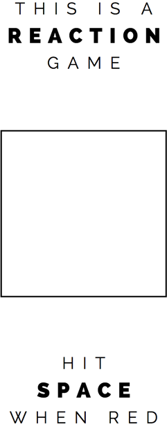
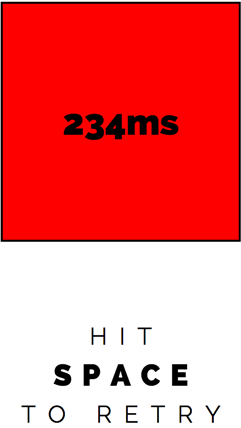
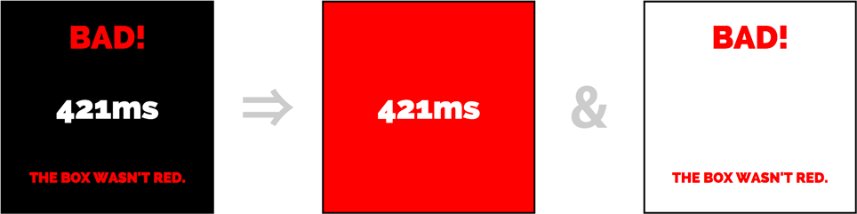

**UPDATE 2015-01-21**: _Since writing this post, Chrome and FF have changed their alpha-blending functions. Demos likely won't work anymore. This is good news!!_

History-sniffing attacks let front-end code peek at other sites you've visited. They can be used to target ads, steal information, or discern your identity. Creepy.

Historically, one of the most popular history-sniffing techniques was to style <code class="language-css">:visited</code> links using CSS and check their color with JavaScript. Major browsers started implementing [privacy changes][ff security] to address this attack in 2010.[^1] As a result, JavaScript's <code class="language-javascript">getComputedStyle</code> now returns unvisited styles for visited sites.

Even with these limitations there are a number of ways to scrape a user's history. The remainder of this article describes a combination of tricks used to do so. The outcome is a proof-of-concept [history-sniffing game][demo].

## Trick #1: Clicking colors

Though <code class="language-javascript">getComputedStyle</code> is a dead-end, sniffers can trick _users_ into telling a script which links they've visited. [This demo][who am i] is the clearest implementation that I've seen; the site shows a grid of styled links and asks you to click the red ones.

I saw the demo above while working on an unrelated game. The game asked players to hit the spacebar when a box turned red.

<figure></figure>

_"Hey"_, I thought to myself, _"this game could be so much more sneaky!"_

I swapped the box out for a stack of links and styled <code class="language-css">:visited</code> to <code class="language-css">background-color:red</code>. It was totally evil and awesome and ready to go!

<figure></figure>

...almost.

<figure></figure>

Since I didn't know when the square was red I was _always_ displaying a score, even on misfires. I'd broken the game.

## Trick #2: Like a polar bear in a snowstorm

Another popular history-sniffing trick is to hide non-<code class="language-css">:visited</code> links by making them appear the same color as the background. [This paper][i still know what you visited last summer] shows some clever examples, as does [this game][defend your spaceship!]. By simply flipping this technique we can hide score text over the white non-<code class="language-css">:visited</code> links. For extra fanciness, we add a red text layer to indicate failure.

<figure>
  
  <figcaption>White and red text are appropriately hidden on their respective backgrounds</figcaption>
</figure>

With just the first two tricks we have a [functioning game](/visited-vectors/reaction/linear.html). Probing one link at a time covers ~60 links per minute and provides solid user insight. Tricks #3 and #4 improve our search algorithm,[^2] increasing read-speed by ~10x.

## Trick #3: CSS decoders

[This paper](http://lcamtuf.coredump.cx/css_calc/) builds an n-input OR gate in CSS using alpha-blending rounding errors. I've embedded my own cross-browser version below; click Result to see it in action:

<pre><code>$in: 0,0,0,0,0,0,0,0,0,1,0,0,0,0,0,0

.container
div
opacity: 0.004
background: white

@for $b from 1 through length($in)
@if nth($in,$b) == 1
.l#{\$b}
background: red

// Everything below this is beside the point...
.container
position: fixed
top: 50%
left: 50%
height: 120px
width: 120px
margin: -62px
border: 4px solid black
font: bold 32px/#{60px} sans-serif
text-align: center
color: red

div
position: absolute
top: 0
left: 0
height: 100%
width: 100%

p
position: relative

.on
color: white
</code></pre>

See the Pen <a href='http://codepen.io/rileyjshaw/pen/CjiKf/'>n-input OR gate in CSS</a> by Riley Shaw (<a href='http://codepen.io/rileyjshaw'>@rileyjshaw</a>) on <a href='http://codepen.io'>CodePen</a>.

An OR gate is "on" if any of its inputs are "on". We can use this to probe n links[^3] at once by stacking them together. Now if a user sees red and hits the spacebar we know that one of the links in the group has been visited.

## Trick #4: Slow recursion

This trick figures out _which_ of a group's links have been visited. We can divide each group into a binary tree for searching but can't rely on simple conditional search algorithms[^4] since we're rate-limited by the user's reaction time.[^5] This means that we must maintain state in our own stack.

If you're curious about specifics, [the whole project is on GitHub](https://github.com/rileyjshaw/visited-vectors/). Since the code's cluttered with game logic I've written a [stripped-down version of Trick #4](https://gist.github.com/rileyjshaw/02c5a8135dd3b1368918).

## Trick #5: Automation

Despite the gains achieved in Tricks #3 and #4, relying on user input will never be as fast as the old <code class="language-javascript">getComputedStyle</code> method.[^6] Since we can no-longer automate color tests, is it possible to avoid looking at color altogether?[^7] Testing 16 links requires alpha-blending 4,096 elements at each step.[^8] This is a non-trivial operation; can we infer what the browser is drawing by testing render and redraw times?

This is a [timing attack](http://carlos.bueno.org/2011/10/timing.html) and I'm not the first to apply it to this context. [Pixel Perfect Timing Attacks with HTML5][] is a _fantastic_ white paper by Context Information Security on the subject. They were able to successfully implement timing attacks using CSS's <code class="language-css">text-shadow</code> property and SVG filters.[^9] So, there's the answer. Now go read that paper.

## Conclusion

I won't be taking over the world with this project[^10] but it demonstrates some interesting vectors. More security patches will be released, more creative hacks will arise; all it takes is a toehold and some creativity. Powerful new features make room for novel vulnerabilities. And so it goes.

Regarding browsing history, reaction games probably aren't your [biggest concern](<http://en.wikipedia.org/wiki/Global_surveillance_disclosures_(2013%E2%80%93present)>) anyway. I'll just [leave](https://www.eff.org/) [these](https://www.torproject.org/) [here](https://tails.boum.org/).

And if you made it this far, just [play the damn game already][demo]!

## References

-   [Mozilla: privacy-related changes coming to CSS :visited][ff security]
-   [Who Am I][]
-   [I still know what you visited last summer][]
-   [Defend your spaceship!]
-   [getComputedStyle benchmark][]
-   [Pixel perfect timing attacks with HTML5][]
-   [Fast and somewhat reliable cache timing][]
-   [History-sniffing in the news (2012)](http://arstechnica.com/security/2012/12/online-marketer-tapped-browser-flaw-to-see-if-visitors-were-pregnant/)

[ff security]: https://hacks.mozilla.org/2010/03/privacy-related-changes-coming-to-css-vistited/
[getcomputedstyle benchmark]: http://saizai.livejournal.com/960791.html
[who am i]: http://tinsnail.neocities.org/
[i still know what you visited last summer]: http://www.ieee-security.org/TC/SP2011/PAPERS/2011/paper010.pdf
[defend your spaceship!]: http://lcamtuf.blogspot.ca/2013/05/some-harmless-old-fashioned-fun-with-css.html
[fast and somewhat reliable cache timing]: http://seclists.org/fulldisclosure/2011/Dec/65
[pixel perfect timing attacks with html5]: http://www.contextis.com/documents/2/Browser_Timing_Attacks.pdf
[demo]: /visited-vectors/reaction/

## Footnotes

[^1]: A noble effort, but it's difficult to plug all the [holes](http://arstechnica.com/security/2014/06/theyre-ba-ack-browser-sniffing-ghosts-return-to-haunt-chrome-ie-firefox/).
[^2]: True under the assumption that the dataset is sparsely populated with <code class="language-css">:visited</code> links. If there is a high percentage of <code class="language-css">:visited</code> links in the set you're actually better off with the linear algorithm. Good news: counting on a sparse dataset is a very safe bet.
[^3]: I settled on n = 16 unique links per stack. Adding more links gives a performance hit, as it's not easy for the browser to composite that many layers (each unique link requires 256 elements). 16 seems to be a sweet-spot.
[^4]: We can win the same O(logn) complexity with a small optimization: if spacebar is hit on level n and then _not_ on the left branch of level n + 1, we can immediately skip to level n + 2 since we know that our result is on the right side. This works because we only need to check for existence.
[^5]: Average human reaction time is just over 250ms, so we can safely budget 1s per frame-change.
[^6]: <code class="language-javascript">getComputedStyle</code> could process [200k-3.4M URLs/min][getcomputedstyle benchmark]. Our test is lucky to get 800 URLs/min.
[^7]: Some history-sniffing attacks focus on entirely different vectors; a common example is to [request external resources and time the response][fast and somewhat reliable cache timing], probabilistically determining whether the result was cached. All current approaches that I've found (including the ones discussed above) are timing attacks.
[^8]: I created a quick demo [here](https://gist.github.com/rileyjshaw/abc13bd2d456669c7d5c) to inspect painting times in DevTools.
[^9]: The coolest part of this paper is the second half; they implement OCR for cross-origin iframes using SVG filters. If you enjoyed my article at all (I assume you did since you made it this far) I _highly_ recommend giving [Pixel perfect timing attacks with HTML5][] a read. It's at least 2 orders of magnitude cooler than my article.
[^10]: ...but just wait until you see the next one.
