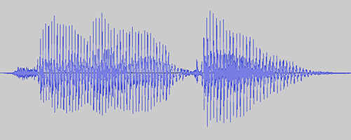
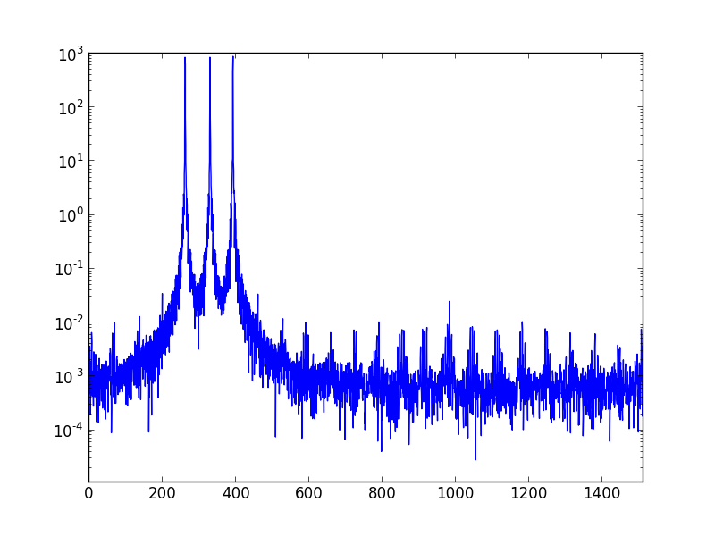
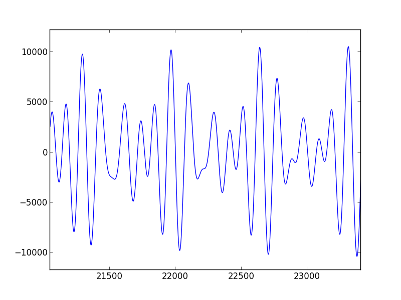
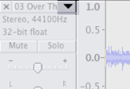

Today I wanted to see what the average frequency of a song would sound like with no spectrum analysis or separation. I had a hunch that it would end up sounding like garbage, and I was totally right.

If you took the average color of a beautiful painting, it would likely turn out poo brown. Today, I created the audio equivalent:

[Blazo's Misty Sapphire](https://youtu.be/rlyYQlPrdac):

<iframe width="100%" height="124" scrolling="no" frameborder="no" src="https://w.soundcloud.com/player/?url=https%3A//api.soundcloud.com/tracks/139984944&amp;color=ff5500&amp;auto_play=false&amp;hide_related=true&amp;show_artwork=false"></iframe>

[Steve Reich's Music for 18 Musicians](https://youtu.be/E_jwv2QMtAo):

<iframe width="100%" height="124" scrolling="no" frameborder="no" src="https://w.soundcloud.com/player/?url=https%3A//api.soundcloud.com/tracks/139984941&amp;color=ff5500&amp;auto_play=false&amp;hide_related=true&amp;show_artwork=false"></iframe>

[Kill the Noise remix of KOAN Sound's Talk Box](https://youtu.be/f-6H8NsfPNQ):

<iframe width="100%" height="124" scrolling="no" frameborder="no" src="https://w.soundcloud.com/player/?url=https%3A//api.soundcloud.com/tracks/139984943&amp;color=ff5500&amp;auto_play=false&amp;hide_related=true&amp;show_artwork=false"></iframe>

These first tones were generated using the powerful, free, cross-platform audio software [Audacity](http://audacity.sourceforge.net/) and a cool lisp-y language called [Nyquist](<https://en.wikipedia.org/wiki/Nyquist_(programming_language)>). Since Audacity lets you run Nyquist scripts on hand-selected audio segments, this first bit was quick and dirty:

1. Drag the desired audio file into [Audacity](http://audacity.sourceforge.net/)
2. On the left side of the window, click the arrow[^1] beside the track's name
3. Select "Split Stereo to Mono" from the resulting dropdown
4. Double-click the top track to select it
5. In the menu bar, click Effect > Nyquist Prompt...
6. Enter the following into the prompt:
    ```lisp
    (setf f0 (aref (yin s 33 93 4400) 0))
    (setf fl (truncate (snd-length f0 ny:all)))
    (setf mean-f0 (snd-fetch (snd-avg f0 fl fl op-average)))
    (format nil "Mean Fundamental Frequency:~%~a ~~~a"
        (step-to-hz mean-f0)
        (nth (round mean-f0) nyq:pitch-names))
    ```
7. If you're using a recent version of Audacity, check the "Use legacy (version 3) syntax" box at the top of the prompt[^2]
8. Let it run and **remember the output frequency**
9. Keeping the track selected, click Generate > Tone... in the top menu
10. Input the frequency that was generated in step 7
11. Repeat 4 - 9 on the bottom track
12. Click the arrow again and select "Make Stereo Track"

It's hack-y and too manual, but it was enough to show me that I definitely didn't want to keep going down this path. From a spectrum this wide, across such a long duration, the tones I was getting didn't correspond to any individual sound in the original song. At best, I'd found a roundabout way to generate spooky alien noises.

## Measures of central tendency

Let's quickly go over _mean_, _median_, and _mode_.

-   **Mean**, often called _average_, is the sum of all values in a set divided by the number of values in the set
-   **Median** is the middle-point in a set ordered by magnitude
-   **Mode**, the ugly cousin of median, is the most commonly occurring value in a set

Given the following set of numbers: { **8, 4, 6, 6 ,8, 4, 8** },

and rearranging them in order: { **4, 4, 6, 6, 8, 8, 8** },

we observe a _median_ of 6, a _mode_ of 8, and a _mean_ of... 6.29?

## Why mean sometimes sucks

Our result above demonstrates why my "average" tones sound nothing like their original tracks. After taking the mean of a set, there's no guarantee that your result will be a member of the set. Just as 6.29 isn't part of the set { **8, 4, 6, 6 ,8, 4, 8** }, the tones that I generated weren't _really_ part of their respective songs. In the process of finding the "average" tone, we lost touch with the most important part of the song; its individual notes.

## More resolution!

After showing this to [a friend of mine](https://twitter.com/f06io), he suggested that I take the average frequency of each quarter-note instead of taking it across the entire song. Remember, this in _no way_ addresses the problem that we just went over.

"It will still sound terrible," I said, "the drums and bass and vocals are going to be mixed into some weird middle-ground tone".

"Yeah," he replied, "but it'll be a different _kind_ of terrible."

I couldn't argue with that. It would be near-impossible to use my old method on a per-note basis since that would require hand-selecting each quarter-note, so I decided to do a better job at it using Python.

Python has some awesome modules for audio analysis, but the underlying math can be pretty intimidating. Though a lot of the heavy-lifting is abstracted away for us, it's important to have a grasp of a few _ideas_ before diving in. Since we're trying to find the average frequency of a tone, let's start by figuring out how to isolate a frequency in a signal!

## Finding frequencies

When we talk about frequencies in music, we're referring to the _frequency_ at which a _pressure wave needs to repeat to make our ears hear a certain note_[^3]. Audio signals are usually represented as a pressure wave over time since that's how microphones and speakers understand sound. When multiple frequencies are played at the same time we end up with a crazy waveform that represents the composite of its individual parts. If we're really clever, we might be able to pick out characteristic waveforms of different sounds just by how they look.

<figure>
  
  <figcaption>Hello there</figcaption>
</figure>

A time-domain representation like this allows us to recognize the structure of a song and to move sections around intuitively. One trade-off of representing audio like this is that filtering or modifying _frequency_ content becomes really difficult as you add more sounds. To play with frequencies, we're going to move from the time-domain into the _frequency-domain_.

## The Fourier Transform

The Fourier transform allows us to move from the time or spatial representations of signals that we're used to into the frequency domain. Calculating the Fourier transform of an audio signal gives you a new representation that looks like this:

<figure>
  
  <figcaption>C major chord in the frequency-domain</figcaption>
</figure>

Here we have frequency on the x-axis and magnitude on the y-axis. The Fourier transform breaks a signal down into its component frequencies; since the diagram above shows high magnitudes at about _260Hz_ (_C_), _330Hz_ (_E_), and _390Hz_ (_G_), it looks like we've got a **C Major chord** on our hands. Easier than trying to figure out the chord from the time-domain, huh?

<figure>
  
  <figcaption>C major chord in the time-domain</figcaption>
</figure>

Wikipedia has the best gif I've ever seen for this:

<figure>
  
  <figcaption>Fourier transform between the time and frequency domains</figcaption>
</figure>

## Got it.

If you didn't understand all of that, don't worry. The important thing to remember is that we need to figure out how powerful each frequency is, and the Fourier transform helps us get there.

First we import a few modules[^4]:

```python
import numpy as np, composer
import scipy.io.wavfile as wav
import scipy.fftpack as fft
from itertools import izip_longest
```

Next, we use scipy's <code class="language-python">wavfile.read</code> to return the audio's sample rate and audio contents.

```python
import_rate, import_data = wav.read('wav/flute.wav')
import_bpm = 62 #manually set
```

...and we're all set up. Finding the average frequency of an audio clip is going to be the meatiest part of this problem, and it's not too bad with the help of scipy and numpy:

```python
def average_frequency(rate, data):
    sample_length = len(data)
    k = np.arange(sample_length)
    period = sample_length / rate
    freqs = (k / period)[range(sample_length / 2)] #right-side frequency range
    fourier = abs(fft.fft(data * np.hanning(sample_length)) / sample_length) #normalized, not clipped
    fourier = fourier[range(sample_length / 2)] #clip to right-side
    power = np.power(fourier, 2.0)
    return sum(power * freqs) / sum(power)
```

Essentially, we're being passed in some audio content and its corresponding sample rate, throwing it through a Fourier transform, and returning the average frequency _as heard by us_. The magnitudes alone don't mean much physically, so we square them to represent the _power_ of each frequency before averaging the range.

Next we need to split the song into chunks to send through the <code class="language-python">average_frequency</code> function. Since we know our sample rate (samples / second) and tempo (beats / minute) already, we can figure out how many samples make up a beat and slice it up.

```python
def quarter_note_frequencies(rate, data, bpm):
    notes = []
    beat_counter = 0
    slice_size = rate * 60 / bpm #samples per beat
    beats = len(data) / slice_size #beats per song
    for slice in grouper(data, slice_size, 0):
        beat_counter += 1
        print unicode(beat_counter * 100 / beats) + '% completed'
        notes.append(average_frequency(rate * 1.0, slice))
    return notes
```

Here we're using a function called <code class="language-python">grouper</code> that lets us slice up the data. It's described in depth in [itertools' Recipes section](https://docs.python.org/2/library/itertools.html#recipes).

We're getting really close! Now we just need a function to write some frequencies to a wav file,

```python
def create_wav(rate, data, bpm):
    duration = 60.0 / bpm #seconds per beat
    wav.write('wav/flute_avg.wav', rate, np.array(composer.generate_tone_series(data, duration), dtype = np.int16))
```

...and a line to call that file...

```python
create_wav(import_rate, quarter_note_frequencies(import_rate, import_data, import_bpm), import_bpm)
```

And we're done! The whole thing (including my <code class="language-python">composer</code> module), is on [Github](https://github.com/rileyjshaw/mean-tone).

Let's hear what it sounds like:

[Them Crooked Vultures' Bandoliers](https://youtu.be/LFQhbZ7Kkig):

<iframe width="100%" height="124" scrolling="no" frameborder="no" src="https://w.soundcloud.com/player/?url=https%3A//api.soundcloud.com/tracks/139987561&amp;color=ff5500&amp;auto_play=false&amp;hide_related=true&amp;show_artwork=false"></iframe>

[The Chemical Brothers' Another World](https://youtu.be/oMu9H7Bkb1Y):

<iframe width="100%" height="124" scrolling="no" frameborder="no" src="https://w.soundcloud.com/player/?url=https%3A//api.soundcloud.com/tracks/139984938&amp;color=ff5500&amp;auto_play=false&amp;hide_related=true&amp;show_artwork=false"></iframe>

[Brian Eno's 2-1](https://youtu.be/AQLh3WanSfg):

<iframe width="100%" height="124" scrolling="no" frameborder="no" src="https://w.soundcloud.com/player/?url=https%3A//api.soundcloud.com/tracks/139985315&amp;color=ff5500&amp;auto_play=false&amp;hide_related=true&amp;show_artwork=false"></iframe>

Wow! Still terrible! Who would've thought!

## Conclusion

It's probably safe to say that this isn't going to be the next-big-thing in music. That said, it was really cool that some songs (see "Another World" above) output a repeating melody different from their own. It's entirely predictable, but I still enjoyed being able to hear it.

I hope to make a Part Two some day where I explore some nicer-sounding alternatives, but I'm hanging up my signal processing hat for a while to focus on other things. One very fun project would be to take a "moving window" through a song and record only the highest magnitude frequencies at each time-step. Doing this, you could subvert the skewing caused by loud, quick tones (snare drum) and artifacts caused by strange envelopes or effects. It isn't a big step from where we got to today, and I'm confident that with enough tuning it could roughly isolate a song's melody.

## Footnotes

[^1]: The arrow looks like this:

    <figure>
      
    </figure>

[^2]: Thanks Nolan Beck for the heads up!

    <figure>
      
    </figure>

[^3]: A 440Hz sine wave, for example, sounds like an **A** to our ears.
[^4]: Including one I wrote called <code class="language-python">composer</code>, which generates an audio signal from the frequencies we pass it
