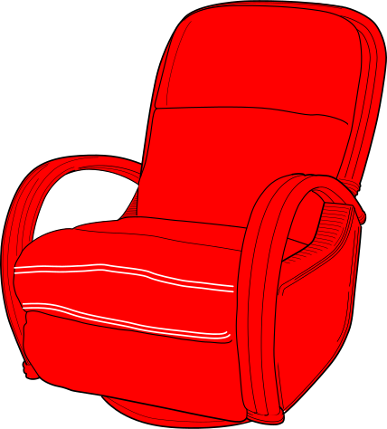
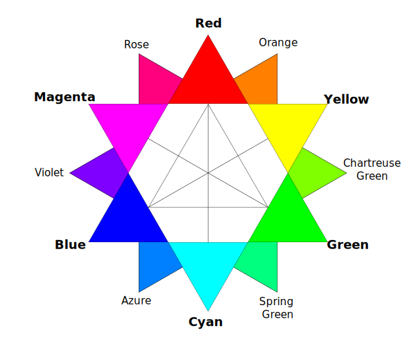

import Figure from 'components/figure';

Guess what? Chemistry isn’t the only high school course built on a _foundation of lies._ In art class we’re taught that the primary colors are red, yellow, and blue. Not only is it wrong to say that there are three true primary colors, but if we _were_ to pick three, we’d pick a better combination.

## Let there be light

A band of wavelengths in the electromagnetic spectrum between 390nm and 700nm makes up the _visible spectrum of light_; we perceive different wavelengths within this spectrum as colors. _White light_ is a combination of all wavelengths in the visible spectrum.

<Figure caption="The visible spectrum of light">

</Figure>

Humans are [trichromats](http://en.wikipedia.org/wiki/Trichromacy), which means that we have three types of color receptors (_cone cells_). Our short-, mid-, and long-wavelength sensing cones sense blue, green, and red respectively; this brings us to the _first_ set of important primary colors.

## RGB

Also known as the _additive_ colors, **R**ed **G**reen and **B**lue light can be combined at different intensities to make up a huge range of colors. They’re called “additive” primaries because when they mix together they become brighter, eventually producing white light. If you had three flashlights with these colors you could make almost any color by shining them on a wall together at different brightness levels; most modern display technologies use arrays of RGB pixels to this effect.

<Figure caption="RGB stands for “Really Great Balance”!">

</Figure>

Above we see that red and green light mix to form yellow, green and blue mix to cyan, and a combination of all three primaries makes white light. The collection of colors within a color space is called a _gamut_, and it turns out that the gamut for RGB is awesomely complete. The additive primaries are useful for light sources, but we tend to use another color model when dealing with light reflectors like paint and ink.

## CMY(K)

When we perceive a chair as red it’s because the chair is absorbing all wavelengths _but_ red so that only red light reaches our eyes. As we mix more paints together we approach black, since each color absorbs particular wavelengths.

<Figure caption={<>This chair looks red because it only reflects red light<a href="#fn:1" class="footnote-ref">1</a></>}>

</Figure>

Stand-in footnote generator[^1]

Just as RGB produces a great gamut for light sources, **C**yan **M**agenta and **Y**ellow are great for printed materials. Adding the three together forms black since no light will be reflected from the mixture; that’s why we call this a _subtractive_ color model. Since ink is expensive and making black from scratch wastes a lot of ink, printers usually include separate black ink as well, which is where the **K** in CMYK comes from[^2].

<Figure caption="Old school: color theory in 1841 suggested the RYB color space">

</Figure>

Since the early 20th century[^3] we’ve been using CMYK as our primary subtractive colors. Before then, the standards were red, yellow, and blue; red served as a rough approximation for magenta, blue for cyan. We discovered that CMYK was better, so we evolved. But our art curriculum didn’t.

## Why the lie?

When I mentioned Chemistry class above it was an unfair comparison. Chemistry curriculums take you through the seven circles of orbital hell because they provide you with some useful analytical models along the way. It seems a bit evil, but I can buy it.

Your art teacher, though… they lied to you for _no good reason!_ There are only three ways that I can semi-justify the red, yellow, blue thing:

-   Teachers are concerned that their students won’t grasp fancy color names like _magenta_ and _cyan_, and thus stick with the monosyllabic _red_ and _blue_.
-   Teachers are trying to provide historical context from before scientific color theory so that students can better understand classical palettes. In reality, it was very uncommon for painters to mix their colors from the primaries, starting instead with a focused palette and more than three base colors.
-   Though I’m still on a hunt for conclusive studies, [color-blindness could be a consideration](#2014-03-24).

Whatever the motivation, teaching RYB as the one-color-space-to-rule-them-all is damaging to future designers. It creates confusion when terms like additive and subtractive spaces are finally taught, and causes debate when blue and red are replaced with cyan and magenta. Worse, it gives red, yellow, and blue _god status_ even though they’re just secondary colors in another space _like every other color_.

## Conclusion

Art teachers are propagating a millenium-old lie that sounds like it could be the beginning of a Dan Brown novel[^4]. Grab your pitchforks, grab your torches… art teachers, we’re coming for ya.

## Addendums

### 2014-03-24

Fellow hacker-schooler [Alex Clemmer](http://www.nullspace.io/) made a great point that since red-green color-blindness is more common than blue-yellow color-blindness, the RYB space may be more accessible. Though most people with RG color-blindness can still differentiate between cyan and magenta, I’m going to try to scape up some comparative accessibility studies.

## Footnotes

[^1]: This would be true for a physical chair, or if you printed this page. If you’re reading this on a screen, it looks red because the red pixels are turned on. Help me out here and imagine it’s a physical chair, ok?
[^2]: The K stands for [key](https://en.wikipedia.org/wiki/Key_plate).
[^3]: Starting in 1906 with the Eagle Printing Ink Company’s [four-color wet process](http://www.sunchemical.com/about/history/).
[^4]: Dan, shoot me an email if you’re interested. I’ve got the first hundred pages ready for printing.
