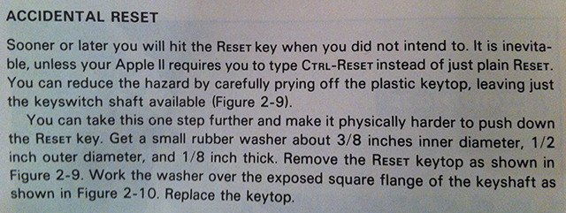

From page 33 of the [Apple II User’s Guide](http://www.librarything.com/work/52052):

> <h3>Accidental Reset</h3>
> Sooner or later you will hit the `RESET` key when you did not intend to. It is inevitable, unless your Apple II requires you to type `CTRL-RESET` instead of just plain `RESET`. You can reduce the hazard by carefully prying off the plastic keytop, leaving just the keyswitch shaft available (Figure 2-9).
>
> You can take this one step further and make it physically harder to push down the `RESET` key. Get a small rubber washer about 3/8 inches inner diameter, 1/2 inch outer diameter, and 1/8 inch thick. Remove the `RESET` keytop as shown in Figure 2-9. Work the washer over the exposed square flange of the keyshaft as shown in Figure 2-10. Replace the keytop.

Sometimes, all you need is a small rubber washer.

