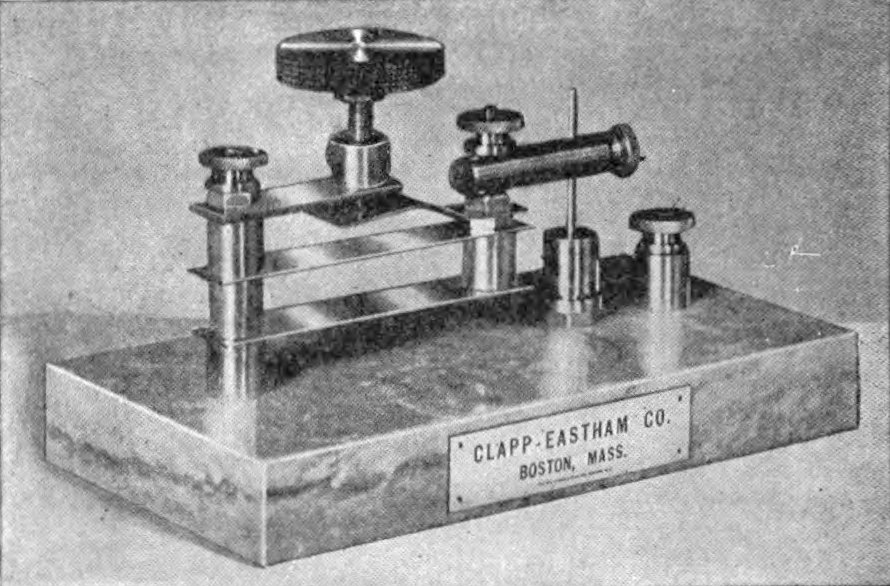

import Figure from 'components/figure';

Semiconductors are important. They allow us to make transistors[^1], which allow us to make integrated circuits, which allow us to build calculators and flight control systems and iPads.

The transistor is the unequivocal poster child of semiconductor physics. It was developed in 1947 by John Bardeen, Walter Brattain, and William Shockley at Bell Labs.

> It may have far-reaching significance in electronics and electrical communication.
> <cite>Bell Labs Press Conference, New York 1948</cite>

This post is not about the transistor. It’s about the beginning of an industry that has changed the way we communicate. It’s also sort of about capitalism.

## History

In 1874, German physicist Ferdinand Braun created a diode out of a metal point and a galena crystal. In doing so, he discovered the semiconductor point-contact rectifier effect. He showed it off in Leipzig in 1876, but nobody really cared because they couldn’t sell it.

In 1901, Jagadis Chandra Bose patented the use of a crystal rectifier for detecting radio waves. At about the same time, G.W. Pickard started documenting crystal rectification properties. He filed his own patent in 1906 for a thin wire pressed against [a crystal](http://en.wikipedia.org/wiki/Galena). Sound familiar? Pickard branded it as the “cat’s-whisker detector”[^2], creating the first commercially available semiconductor device. It recovered information from modulated telegraphy radio waves. Later, during World War I it gained popularity as an AM audio signal demodulator.

<Figure caption="Precision Cat’s Whisker Detector">

</Figure>

As is often the case, radio followed the trajectory of geek to military to Sears catalog. By 1920 it was a household entertainment medium, with millions of cat’s-whisker detectors in production. Pickard’s advancements resulted from experimentation; in his career, he tested over 30k combinations of wire and crystal. The physics behind crystal-based semiconductors weren’t well understood, but mainstream adoption meant that they were getting more attention than ever before.

In 1920, amplifying vacuum tubes superseded crystal detectors; semiconductor research was gaining speed and pushed through the decline of crystal radio. Progress continued, and in 1940 the p-n junction – the Lego block of semiconductor devices – was discovered. Semiconductor diode rectifiers made a comeback as microwave detectors in WWII, leading to smaller, higher-purity crystals. The transistor was invented in 1947, but as I said earlier, this is not about the transistor. It’s about the cat’s-whisker diode.

## Physics

Feel free to skip this part; I think it’s really interesting but won’t be too offended if you disagree.

The cat’s-whisker detector is a primitive point-contact diode. A point-contact junction is the simplest implementation of a Schottky diode, which is a majority-carrier device formed by a metal-semiconductor junction. This contrasts the more common semiconductor-semiconductor configuration. Because of their high switching speed, high frequency capability, and low forward voltage drops, Schottky diodes are well-suited for radio detection.

A cat’s-whisker detector is implemented as a thin, springy bronze wire pressed against a crystal. The N-type crystal acts as a cathode and the metal wire acts as an anode. The crystal is typically a small sample of unrefined galena. Galena has a small bandgap of 0.4eV, and is thus fairly conductive. Apart from the single exposed face, the crystal rests in a conducting cup with wires to radio circuitry.

In the early 1900s, there was no way to differentiate between crystals with good and poor detecting properties. Also, excess pressure would lead to bidirectional current flow through the wire. As such, crystals only formed a proper diode at select surface points. A movable arm held the wire, which allowed it to drag across the crystal’s surface until it found a suitable probing location.

## Conclusion

The cat’s-whisker detector succeeded for almost 15 years before less-finicky vacuum tubes supplanted them. As the first commercial semiconductor device, the cat’s-whisker radio moved semiconductors into the home. Military and economic forces behind early 1900s radio made huge contributions to semiconductor research. The cat’s-whisker radio was thus a big step toward the silicon chips we use today.

Cat’s-whisker detectors are now obsolete, but they provided some sweet insight toward semiconductor physics before kicking the bucket.

## References

-   [Microelectronic Circuits, 6th Edition](http://thepiratebay.se/)
-   [The Silicon Engine](http://www.computerhistory.org/semiconductor/timeline.html)
-   [Popular Science, October 1944](http://books.google.ca/books?id=PyEDAAAAMBAJ&pg=PA206&redir_esc=y#v=onepage&q&f=false)
-   [Wikipedia, obviously](http://en.wikipedia.org/wiki/Cat%27s_whisker)

## Footnotes

[^1]: And solar cells, and LEDs, and analog ICs, and…
[^2]: With regard to the practical application of the device, “detector” is a bit of a misnomer; the device acted as a demodulator. This inaccuracy is historically common in radio terminology.
