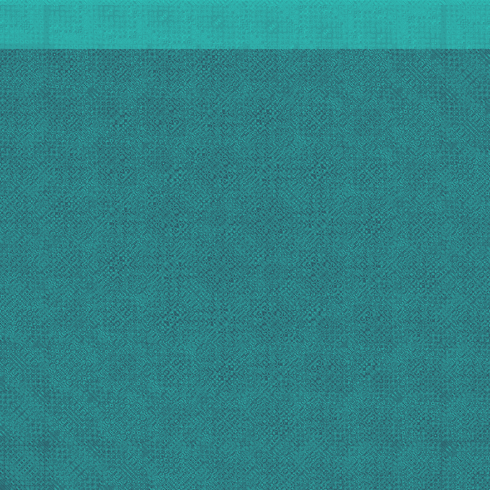
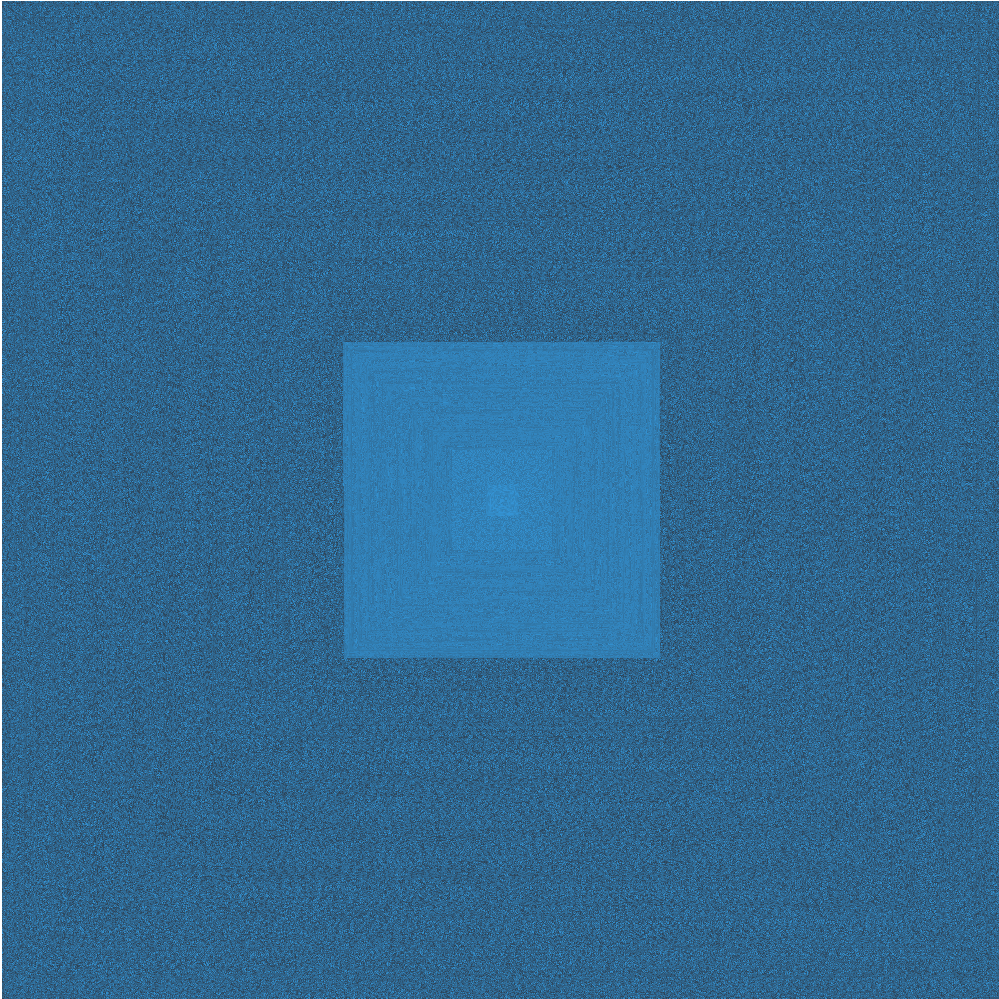
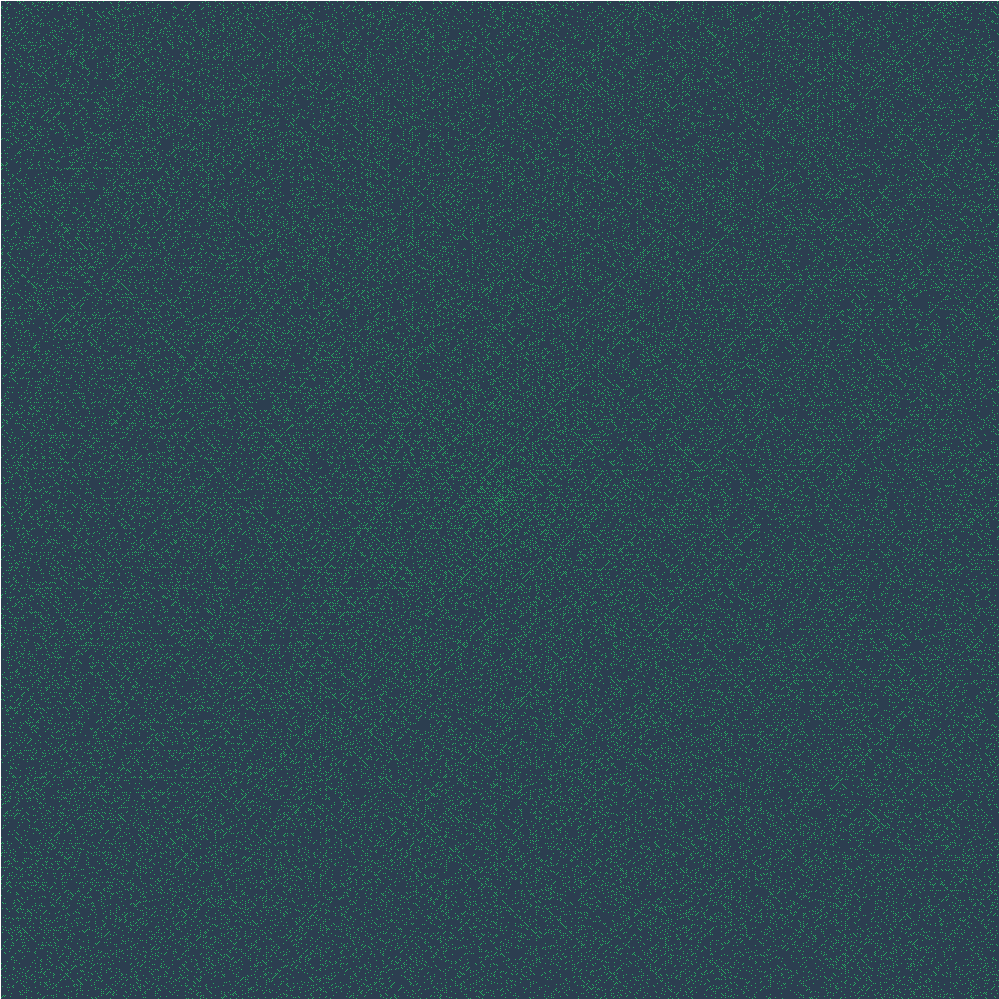

import Figure from 'components/figure';

There’s something magical about a procedure that just works. Even if you don’t understand _why_ it works, having a set of steps that will always get you to the same destination feels nice. In life there are few patterns that consistently produce the same outcome. But in math? Hoo boy…

This post takes us through two _very_ simple procedures that converge to a numerical endpoint. We’re going to graph the amount of time it takes to reach this endpoint, which actually ends up being quite pretty.

Careful; such routines can be somewhat of a rabbit hole. As [xkcd](http://xkcd.com/710/)’s Randall Munroe puts it,

> The Collatz Conjecture states that if you pick a number, and if it’s even divide it by two and if it’s odd multiply it by three and add one, and if you repeat this procedure long enough, eventually your friends will stop calling to see if you want to hang out.

## 6174,

or Kaprekar’s Constant, is the endpoint of one such procedure. If we run any[^1] four-digit number through the following steps:

1. arrange the digits in descending and then in ascending order to get two four-digit numbers, adding leading zeros if necessary
2. subtract the smaller number from the bigger number
3. repeat

We’ll reach 6174 in at most 7 iterations.

Let’s go through a quick example using 1989[^2], which breaks into 9981 and 1899:

1. 9981 - 1899 = 8082
2. 8820 - 0288 = 8532
3. 8532 - 2358 = 6174 (yay!)

Let’s call the number of iterations it takes an input to reach 6174 its _depth_.[^3] Here’s a quick program to return the Kaprekar depth of a 4-digit number:

```javascript
function kaprekar(num) {
	function step(cur, depth) {
		// return the depth if our current number is 6174 (or 0 for repdigits)
		if (cur === 6174 || !cur) return depth;

		// otherwise, split the current number into an array
		// of digits and sort it in ascending order
		var lo = String(cur).split('').sort();

		// make a new array of the numbers in descending order
		var hi = lo.slice().reverse();

		// turn the arrays back into integers
		lo = +lo.join('');
		hi = +hi.join('');

		// recursively call the function on the difference, adding 1 to depth
		return step(hi - lo, depth + 1);
	}

	// initialize the first step with a depth of 0
	return step(num, 0);
}
```

Running <code className="language-javascript">kaprekar(1989)</code> returns <code className="language-javascript">3</code>. Success!

## More digits

If we’re dealing with one digit we can set the fixed point at 0. Cool. What about two digits?

- 63 - 36 = 27
- 72 - 27 = 45
- 54 - 45 = 09
- 90 - 09 = 81
- 81 - 18 = 63
- 63 - 36 = uh oh…

It looks like we’ve found our way into a loop. Going off our original definition, the Kaprekar depth at 63 would be infinity.

Since Kaprekar’s routine is deterministic, as soon as we run into a number we’ve already seen we’re stuck in the same loop of numbers. We don’t get any new information at this point, so let’s redefine depth to mean _the amount of steps it takes until a number we’ve seen before reemerges_. This still works for fixed-point convergence, since 6174 “reemerges” on the next step.

Using this new definition, the depth of 63 is 5. Let’s update our code:

```javascript
function kaprekar(num) {
	function step(cur, prev, depth) {
		// return the depth - 1 if we’ve come across this number before
		if (prev[cur]) return depth - 1;
		// otherwise, log that we’ve now seen the current number
		else prev[cur] = true;

		// find the ascending and descending parts as we did before
		// …

		// and take it one level deeper
		return step(hi - lo, prev, depth + 1);
	}

	// initialization for the first step
	return step(num, {}, 0);
}
```

Great! This function should work with fixed point and fixed series (loop) stopping conditions. Running <code className="language-javascript">kaprekar(63)</code> now returns <code className="language-javascript">5</code>; before, it would’ve tried to crash your browser.

## The fun part

Now that we have a function to determine the Kaprekar depth[^4] of an arbitrary number; let’s visualize it! We’ll first need to write a drawing function that starts at 0 and moves left-to-right, top-to-bottom until it reaches the bottom-right corner. The code looks like this:

```javascript
function draw(rows, cols, fn) {
	for (var y = 0; y < rows; y++) {
		for (var x = 0; x < cols; x++) {
			drawPixel(fn(x + y * cols), x, y);
		}
	}
}
```

Calling this function with the arguments,

```javascript
draw(kaprekar, 1000, 1000);
```

results in a plot of total cycle depth for the Kaprekar Routine for the range [0, 1M). Each pixel represents an integer, with 0 in the top left corner and 999999 in the bottom right. Dark pixels represent a high depth at that number; the max depth for this range is shockingly low at 19.

<Figure caption={<>Kaprekar Routine Depths: [0, 1M). <a href="http://codepen.io/rileyjshaw/pen/hipBu" rel="noopener noreferrer" target="_blank">View code</a></>}>



</Figure>

The [_View code_ link](http://codepen.io/rileyjshaw/pen/hipBu) above uses the same code as our example with a bit of color logic tacked on, and a drawing loop that only computes 1% at a time to make sure your browser doesn’t freeze.

Since numbers with fewer digits reach their stopping condition sooner, a light band is observable at the top of the image. Since any two numbers composed of the same digits run through the same steps, a few axes of symmetry can be observed.

## Enter Ulam

Mathmetician Stanislaw Ulam made an interesting discovery while doodling during the presentation of a &ldquo;long and very boring paper&rdquo;. He started by writing the natural numbers in a rectangular spiral with 1 in the center:

<Figure caption="Ulam Spiral: [1, 50)">


</Figure>

In our Kaprekar graph we decided that the drawing function should move from top-left to bottom-right. Let’s see if we can make a drawing function that starts in the center and moves outwards in an Ulam spiral[^5]:

```javascript
function drawUlam(maxVal, fn) {
	var directions = [
		{x: 1, y: 0}, // 0: right
		{x: 0, y: -1}, // 1: up
		{x: -1, y: 0}, // 2: left
		{x: 0, y: 1}, // 3: down
	];
	var center = Math.ceil(Math.sqrt(maxVal) / 2); // center point of the grid
	var run = 1; // current spiral arm length
	var redirect = 3; // next number that the spiral changes direction at
	var direction = 0; // current direction
	var position = {
		x: center - 1, // offset x by -1; we move right before drawing
		y: center,
	};

	for (var i = 1; i < maxVal; i++) {
		if (i === redirect) {
			direction = (direction + 1) % 4;
			// run increases when switching left or right
			if (direction % 2 === 0) run++;
			redirect += run;
		}
		position.x += directions[direction].x;
		position.y += directions[direction].y;
		drawPixel(fn(i), position.x, position.y);
	}
}
```

By replacing the drawing function in our Kaprekar depth example with <code className="language-javascript">drawUlam()</code> we get the following graph for the range [0, 998k):

<Figure caption={<>Ulam Spiral of Kaprekar Routine depths: [0, 998k). <a href="http://codepen.io/rileyjshaw/pen/gixuE" rel="noopener noreferrer" target="_blank">View code</a></>}>



</Figure>

The light band has been transformed into a series of darkening squares, with clear distinctions at each digit boundary.

## The Collatz Conjecture

### Let it hail

The second procedure that we’re looking at is called the Collatz Conjecture[^6]. It’s widely recognized and as-yet unproven, which is also true of Kaprekar’s Routine. We start with any integer, then:

1. if the number is odd, divide it by two
2. if the number is even, multiply it by three and add one
3. repeat

The Collatz Conjecture states that no matter what number we start with, it will always eventually reach 1. This has been verified for numbers up to at least 5.764×10<sup>18</sup> at the time of writing.

To graph this, we can define depth to mean the number of iterations until 1 is reached. Here’s a quick first pass at a <code className="language-javascript">collatz()</code> function:

```javascript
// naive implementation
function collatz(num) {
	var depth = 0;

	while (num !== 1) {
		num =
			num % 2
				? num * 3 + 1 // num is odd
				: num / 2; // num is even

		depth++;
	}

	return depth;
}
```

The above function _works_, but it’s not very efficient; running the numbers from 1 to 1M using this function would waste a _lot_ of time on repeated cycles. Let’s imagine running the number 5 through our procedure:

1. &nbsp;&nbsp;<code>5&nbsp;&nbsp;↦ ×3+1</code>
2. &nbsp;&nbsp;<code>16 ↦ ÷2</code>
3. &nbsp;&nbsp;<code>8&nbsp;&nbsp;↦ ÷2</code>
4. &nbsp;&nbsp;<code>4&nbsp;&nbsp;↦ ÷2</code>
5. &nbsp;&nbsp;<code>2&nbsp;&nbsp;↦ ÷2</code>
6. &nbsp;&nbsp;<code>1</code>

Soon after, we would have to calculate the depth of 10:

1. &nbsp;&nbsp;<code>10 ↦ ÷2</code>
2. &nbsp;&nbsp;<code>5&nbsp;&nbsp;↦ ×3+1 // repeated</code>
3. &nbsp;&nbsp;<code>16 ↦ ÷2 &nbsp; // repeated</code>
4. &nbsp;&nbsp;<code>8&nbsp;&nbsp;↦ ÷2 &nbsp; // repeated</code>
5. &nbsp;&nbsp;…

Like Kaprekar’s Routine, this procedure is deterministic. That means that _whenever_ we see the number 5, we’ve got 5 more steps until we see the number 1. By [memoizing](http://en.wikipedia.org/wiki/Memoization) the <code className="language-javascript">collatz()</code> function, we avoid running these repetitive cycles.

```javascript
// slightly better memoized implementation
var collatz = (function () {
	var memo = {
		1: 0,
	};

	return function (cur) {
		var l,
			_len,
			memoized,
			past = [];

		while (typeof memo[cur] === 'undefined') {
			past.push(cur);
			cur = cur % 2 ? cur * 3 + 1 : cur / 2;
		}

		memoized = memo[cur];

		// throw past values into memo
		for (l = _len = past.length; l--; )
			memo[past[l]] = _len - l + memoized;

		return past.length + memoized;
	};
})();
```

Replacing the <code className="language-javascript">kaprekar()</code> function in our first example with <code className="language-javascript">collatz()</code> yields the following graph:

<Figure caption={<>Collatz Conjecture depths: (0, 1M]. <a href="http://codepen.io/rileyjshaw/pen/hayod" rel="noopener noreferrer" target="_blank">View code</a></>}>

![Total cycle depth for the Collatz Conjecture in the range (0, 1M]](../../../../../content/images/blog/collatz.png)

</Figure>

The banding that’s observed is interesting; it looks almost like cloth grain. This tells us that sequential numbers are more likely to have similar depths.

Using the <code className="language-javascript">ulam()</code> drawing function, we get:

<Figure caption={<>Ulam Spiral of Collatz Conjecture depths: (0, 998k]. <a href="http://codepen.io/rileyjshaw/pen/fihEm" rel="noopener noreferrer" target="_blank">View code</a></>}>

![Total cycle depth for the Collatz Conjecture in the range (0, 998k] drawn in an Ulam Spiral](../../../../../content/images/blog/collatz-ulam.png)

</Figure>

Pretty.

## Conclusion

We set out to make some nice looking graphs; we now have four of them[^7]. But why stop there? As we’ve seen, a great advantage to keeping the depth function separate from the drawing function is that we can easily swap in new functions[^8]. A great place to find inspiration for new functions is [The On-Line Encyclopedia of Integer Sequences](https://oeis.org/https://oeis.org/).

Have fun!

[^1]: Except for repdigits like 3333, which reach their fixed point of 0 after one step.
[^2]: [The number. Another summer.](http://youtu.be/M8G8aqlegYI)
[^3]: i.e. with input _n_ and depth _t_ we’re looking for _t_ where &fnof;<sub>_n_</sub>(_t_) = &fnof;<sub>_n_</sub>(_t_ - 1). More generally, &fnof;<sub>_n_</sub>(_t_) = &fnof;<sub>_n_</sub>(_t_ - _L_), where _L_ = fixed-loop size. But we’ll get to that part soon.
[^4]: A neologism, as far as I can tell. “Stopping time” is likely more appropriate.
[^5]:
    The Ulam Spiral story doesn’t end with a different drawing function. The presentation that he was sitting in on must have been really boring, because Ulam started circling prime numbers on his spiral:

    <Figure caption="Ulam Spiral with prime numbers shown: [1, 50)">

    

    </Figure>

    He noticed that the primes tended to line up along certain diagonal lines more than others. This isn’t evident in the small grid above, but we can repurpose our old code to generate a larger grid. If we replace the <code className="language-javascript">kaprekar()</code> function with a function that only returns a color if the number is prime, we can visualize Ulam’s diagonal primes:

    <Figure caption={<>Ulam Spiral with prime numbers shown: [0, 988k). <a href="http://codepen.io/rileyjshaw/pen/gaHhn" rel="noopener noreferrer" target="_blank">View code</a></>}>

    

    </Figure>

[^6]: The Collatz Conjecture has many names. You might know it as: the 3n + 1 conjecture, the Ulam conjecture, Kakutani’s problem, the Thwaites conjecture, Hasse’s algorithm, the Syracuse problem, the hailstone sequence, hailstone numbers, or wondrous numbers.
[^7]: Five if you count the footnotes!
[^8]: This is known as [function composition](<http://en.wikipedia.org/wiki/Function_composition_(computer_science)>).
