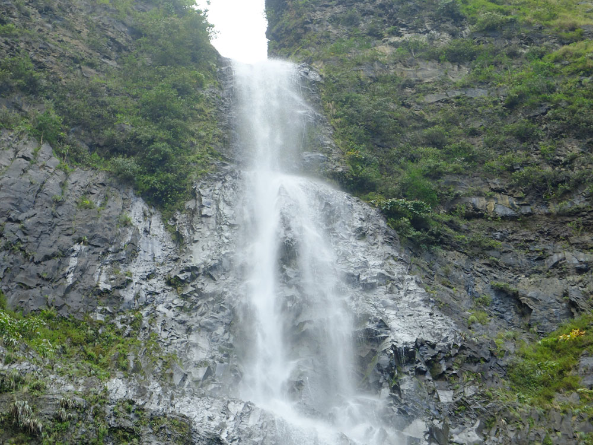
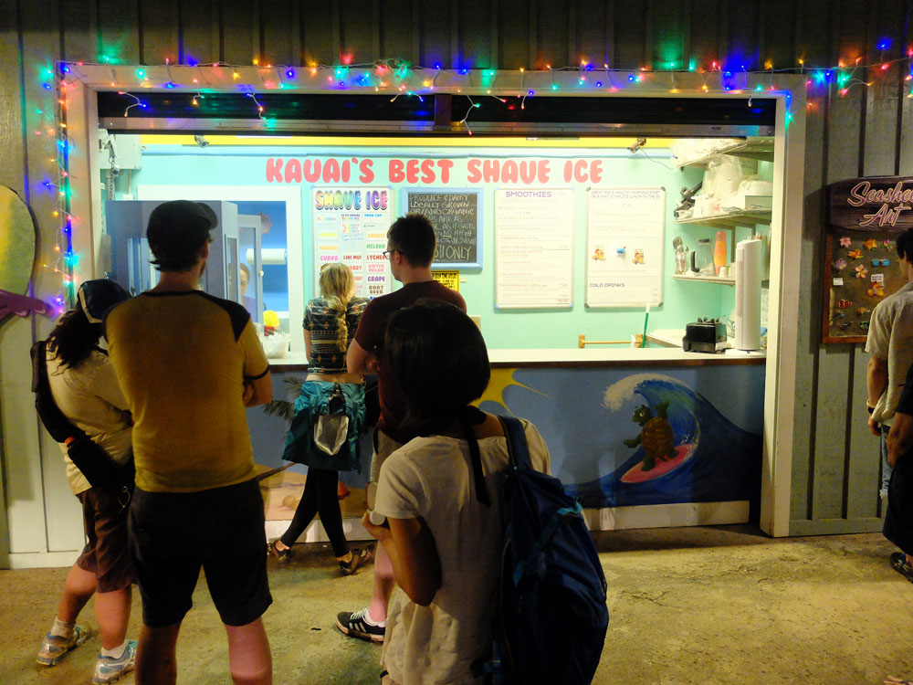
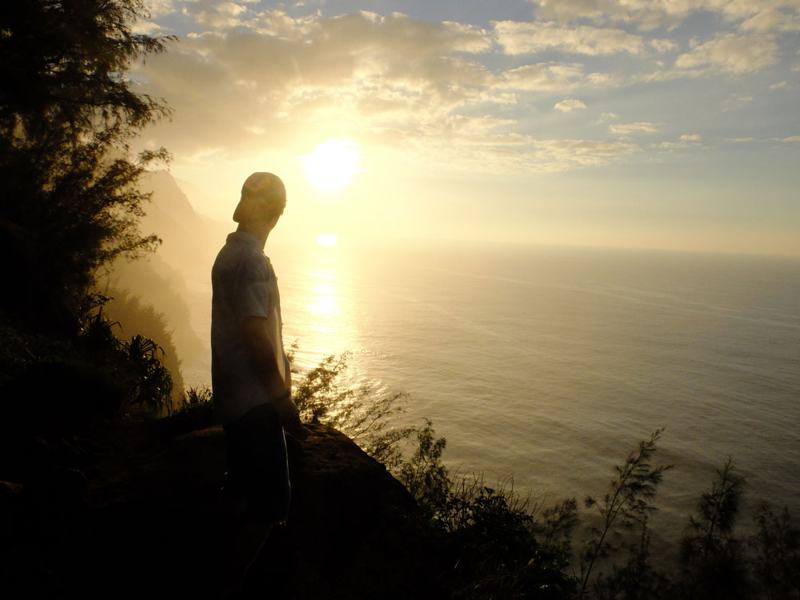

_This post was originally published on the [Open Whisper Systems blog](https://whispersystems.org/blog/the-pool-on-the-roof-must-have-a-leak/)._

Today we hiked the Kalalau Trail and swam beneath the cold spray of a waterfall.

Today we discussed the finer points of the axolotl protocol used by TextSecure.

Today we delighted in "shave ice", a local delicacy that is definitely _not_ a snow cone.

Today we wrote copy, polished features, closed bugs, and merged pull-requests.

Measured by lines of code, today was short. Measured by steps taken, it was tall. Measured by ideas discussed, things learned, and sights seen, it was towering.

For the past week and a half I've been trapped on an island among a team of brilliant hackers. A curious duality exists on the island. At sunrise, stand-up paddleboard yoga is followed naturally by a technical stand-up meeting. A group huddling around a laptop for hours may swiftly disband upon noticing big surf. This isn't an idle vacation, nor is it daunting contract work. We're nineteen people fervently working toward a noble goal in a stress-free mind amphitheater.

## Trust on first use

Coming here was a leap of faith. Before leaving, friends and family were incredulous:

> So they're going to fly you to Hawaii. And give you a surfboard. And teach you things. So that you can work on a project that you wanted to work on anyway?

Though it sounded too good to be true, sparse details soon surfaced in our inboxes:

> This is your plane ticket. This is our house. This is who will pick you up.

We arrived in Hawaii with backpacks and a vague idea of what the next two weeks would hold. The uncertainty distilled a group of self-motivated people who _really_ wanted to pitch in. The lack of granular detail allowed us to fill in gaps and make the trip our own.

## An activist, an anarchist, and an astrophysicist walk into a bar...

One of the best parts of this trip has been the conversation. The group brings a wide range of perspectives, each passionate and thoughtful. While discussing the nebulous moral code of young countries over dinner, someone asked:

> Okay, but what does "free will" even mean?

There was an outcry,

> "Woah, come on, don't ask a question like that!"

a pause, then:

> "we have to save _something_ to talk about tomorrow!"

The most important part of an experience like this is having interesting people to share it with. On this trip, we've got 'em in spades.

## Body and mind

Since arriving I've restructured the browser extension's event system and kayaked beside a family of sea-turtles. The day that I watched a rainstorm pass by while Lilia played ukulele was the same day that I allowed multiple conversation instances to open concurrently. If there was any uncertainty it's long gone now, replaced by a fulfillment that stretches far beyond these two weeks.

