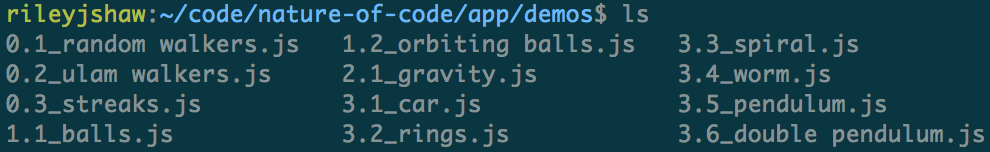

## An entirely skippable preface

_(Seriously, we don’t start building it until the [third section](#building-html-from-a-directory-of-assets).)_

While going through some of my dustier folders on a [flight to Hawaii](../the-pool-on-the-roof-must-have-a-leak/) I came across <a href="http://natureofcode.com/book/" rel="noopener noreferrer" target="_blank">The Nature of Code</a>. It’s a lovely book with plenty of inspiration for simple demos; perfect plane material.

After working through a few chapters, I moved my particle system and canvas logic into their own `util.js` file. Until then i’d been creating a new HTML file for each demo, manually adding the title, script includes, and next/previous links. This meant that I had to edit each file to include `util.js`. It was a frustrating amount of overhead considering each demo only took a few minutes to write.

## didn’t someone solve this problem 30 years ago?

Yes they did, snarky title, but most templating engines I’ve used make you hook up dependencies <a href="http://en.wikipedia.org/wiki/Imperative_programming" rel="noopener noreferrer" target="_blank">imperatively</a>. This works great for files like `util.js`, because you know it should be included on every page. But I wanted a static HTML page generated automatically for each `demo.js` I churned out; if I had to write a corresponding `demo.jade` file each time, i’d be back to where I started. To solve this problem <a href="http://en.wikipedia.org/wiki/Declarative_programming" rel="noopener noreferrer" target="_blank">properly</a>, I needed to step a bit beyond what templating could offer.

Being on a plane, I wasn’t able to check out <a href="http://www.metalsmith.io/" rel="noopener noreferrer" target="_blank">Metalsmith</a> or any of the other non-bloggy static site generators[^1]. I was already using <a href="http://gulpjs.com/" rel="noopener noreferrer" target="_blank">Gulp</a> to lint my code, so I added a `build` task and got to work.

## Building HTML from a directory of assets

We have two requirements for our site generator:

1.  Read a list of demo scripts from our `demos` directory, and
2.  Generate a unique HTML page for each demo. The page must include the proper assets, and next/previous links to other demos.

While reading this, keep in mind that _you can do this for any type of file_. The same method can be used to monitor a Dropbox folder full of photos, or an archive of .csv files.

Gulp is a task runner that lets you automate some of the more mundane parts of your workflow. If you’ve never used it, you might want to go through a <a href="http://markgoodyear.com/2014/01/getting-started-with-gulp/" rel="noopener noreferrer" target="_blank">quick tutorial</a> before continuing.

### Step 1: Standardize your filenames

For the sake of simplicity, we’ll base our output’s structure on the demos’ filenames[^2]. I opted for `chapterNum.demoNum_demoName`[^3], but anything that can be sorted is fine.



### Step 2: Read the files into Gulp

To get a list of demos into Gulp, I used a module called <a href="https://www.npmjs.com/package/glob" rel="noopener noreferrer" target="_blank">glob</a>[^4].

```javascript
var glob = require('glob');
var gulp = require('gulp');
var path = require('path');

gulp.task('build' function () {
  return glob('../path/to/demos/', function (err, files) {
    // …
  });
});
```

We now have a list of filenames in `files`. That’s all we need, thanks to our trusty [semantic filenames](#step-1-standardize-your-filenames).

### Step 3: Sort and sanitize the files

Within our callback for `glob`, we can rename and rearrange our files based on whatever rules we want. I chose to sort the files in reverse order, so the newest demos would be shown first. After sorting the files, I stripped off their numbers, leaving me with a sorted fileName array.

```javascript
// …
// (within glob’s callback argument)

// get the basename from our files
files = files.map(function (name) {
	return path.basename(name, '.js');
});

// sort the files in reverse order
files.sort(function (a, b) {
	return parseFloat(a) < parseFloat(b);
});

// remove the numbers once we’re in sorted order
files = files.map(function (name) {
	return name.slice(name.indexOf('_') + 1);
});
```

Our last step in `glob`’s callback is to send each file to a `buildHTML()` function. This is where the magic happens.

```javascript
files.forEach(function (demoName, i) {
	// files[i + 1] and [i - 1] will only be truthy if they exist
	return buildHTML(demoName, i, files[i + 1], files[i - 1]);
});
```

In addition to sending a demo’s name and index to `buildHTML()`, I also sent its next/previous neighbors. This allows for simple linking between pages.

### Step 4: Make a template

Now that we have all the metadata we need, we can start using templates. Here are the simple <a href="http://jade-lang.com/" rel="noopener noreferrer" target="_blank">jade</a>[^5] files I used:

`default.jade`:

```markup
doctype html
html(lang="en")
  head
    block title
    link(href="styles.css" rel="stylesheet" type="text/css")
    //- favicon, etc.
  block body
```

`demo.jade`:

```markup
extends ./default.jade

block title
  title "Demo #{i}: #{demoName.charAt(0).toUpperCase() + demoName.slice(1)} | Nature of Code"

block body
  body.demo
    if prev!==null
      a.prev(href="#{prev}.html") Prev
    if next!==null
      a.next(href="#{next}.html") Next
    script(src="util.js")
    script(src="demos/#{demoName}.js")
```

With variables passed in from Gulp, we can automatically set the title, pull in the correct script, and set our next/previous links.

### Step 5: Build your files

Finally, we send our data from Gulp into the `demo.jade` template:

```javascript
var jade = require('gulp-jade');
var rename = require('gulp-rename');

function buildHTML(demoName, i, next, prev) {
	gulp.src('../path/to/demo.jade')
		.pipe(
			jade({
				locals: {
					demoName: demoName,
					i: i,
					next: next ? i + 1 : null,
					prev: prev ? i - 1 : null,
				},
			}),
		)
		.pipe(gulp - rename(i + '.html'))
		.pipe(gulp.dest('../path/to/dist/'));
}
```

I decided to name pages `1.html`, `2.html`, etc. so that they’d be easy to jump to using the navigation bar. More expressive names could easily be swapped in.

## Next steps

There are still some goodies that we can throw into our task runner[^6], but I’ll leave the rest as an exercise for the reader. A working project with all the bells and whistles can be found at my <a href="https://github.com/rileyjshaw/nature-of-code" rel="noopener noreferrer" target="_blank">Nature of Code repo</a>. Its generated site is live <a href="http://rileyjshaw.com/nature-of-code/" rel="noopener noreferrer" target="_blank">here</a>.

## References

-   <a href="https://github.com/rileyjshaw/nature-of-code/" rel="noopener noreferrer" target="_blank">GitHub repository</a>
-   <a href="http://rileyjshaw.com/nature-of-code/" rel="noopener noreferrer" target="_blank">Live demo</a>

[^1]: If you’re looking to make something more complicated than simple linked pages, <a href="https://www.staticgen.com/" rel="noopener noreferrer" target="_blank">go here</a>.
[^2]: Doing this felt yucky initially, but I came to really like having a strict naming convention. Opening the demos directory and having your app’s structure immediately apparent is very handy.
[^3]: One of my biggest concerns with this: once i’d written demos `1.5`, `1.6`, and `1.7`, how could I add anything between `1.5` and `1.6` without renaming a whole cascade of files? This turned out to not be a concern. Since we’re just using the numbers for sorting in Gulp, `1.51` is perfectly valid for an input. We can name the output `1.6` and shift the rest accordingly.
[^4]: There are about as many ways to get a list of filenames in Node as there are Node modules. Glob is a simple option, but anything will do.
[^5]: Likewise, there is no magical reason to use jade over anything else so feel free to use your preferred templating language. I chose jade mainly because it was already installed on my computer and I had no internet connection.
[^6]: Most importantly, <a href="https://github.com/rileyjshaw/nature-of-code/blob/0d70ea473eca2267d5c8413c3a7f2bd8e79b806b/gulpfile.js#L87" rel="noopener noreferrer" target="_blank">transferring static assets into the `dist` folder</a> and <a href="https://github.com/rileyjshaw/nature-of-code/blob/0d70ea473eca2267d5c8413c3a7f2bd8e79b806b/gulpfile.js#L98" rel="noopener noreferrer" target="_blank">watching files for changes</a>.
